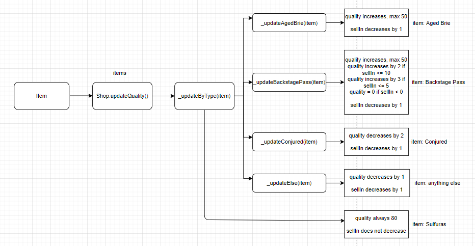

# Gilded Rose tech test

This is a practice tech test I did during Week 10 at Makers Academy.

The goal is to practice refactoring, good design, writing good tests and practice handling a legacy code situation.

## Specification

Hi and welcome to team Gilded Rose. As you know, we are a small inn with a prime location in a
prominent city ran by a friendly innkeeper named Allison. We also buy and sell only the finest goods.
Unfortunately, our goods are constantly degrading in quality as they approach their sell by date. We
have a system in place that updates our inventory for us. It was developed by a no-nonsense type named
Leeroy, who has moved on to new adventures. Your task is to add the new feature to our system so that
we can begin selling a new category of items. First an introduction to our system:

	- All items have a SellIn value which denotes the number of days we have to sell the item
	- All items have a Quality value which denotes how valuable the item is
	- At the end of each day our system lowers both values for every item

Pretty simple, right? Well this is where it gets interesting:

	- Once the sell by date has passed, Quality degrades twice as fast
	- The Quality of an item is never negative
	- "Aged Brie" actually increases in Quality the older it gets
	- The Quality of an item is never more than 50
	- "Sulfuras", being a legendary item, never has to be sold or decreases in Quality
	- "Backstage passes", like aged brie, increases in Quality as its SellIn value approaches;
	Quality increases by 2 when there are 10 days or less and by 3 when there are 5 days or less but
	Quality drops to 0 after the concert

We have recently signed a supplier of conjured items. This requires an update to our system:

	- "Conjured" items degrade in Quality twice as fast as normal items

Feel free to make any changes to the UpdateQuality method and add any new code as long as everything
still works correctly. However, do not alter the Item class or Items property as those belong to the
goblin in the corner who will insta-rage and one-shot you as he doesn't believe in shared code
ownership (you can make the UpdateQuality method and Items property static if you like, we'll cover
for you).

Just for clarification, an item can never have its Quality increase above 50, however "Sulfuras" is a
legendary item and as such its Quality is 80 and it never alters.

## How to use

Open SpecRunner.html in the browser, this will automatically run the tests.

In the browser console, you can create instances of the Item class & Shop class, see what's in the shop, then run the `updateQuality` method, like so:

## My approach  

I used Javascript, and Jasmine for testing.
I diagrammed the flow of the code to understand the legacy code. Then I diagrammed the classes and methods as they are in the legacy code, not changing it yet.
I wrote tests for every type of item to check how the `updateQuality` method changes the `sellIn` and `quality` attributes of the items. This way I make sure that when refactoring the code I will not break the code by accident.

There are 5 types of items in the Gilded Rose: `Aged Brie`, `Sulfuras`, `Backstage Pass`, `Conjured` and everything else. The best way to organise the code would probably be to create separate classes base on the type of item, however we are not allowed to change the `Item` class.
First I refactored the massive conditional statements into more readable code, still using if/else statements. Then I introduced private methods that will be executed depending on the type of item, to calculate their quality and sellIn values.
Finally I used the object literal pattern to replace the conditional that controls what code to run for what type of item, and used ternary operators to make the code dryer.

## Domain Model

## Flow diagram

